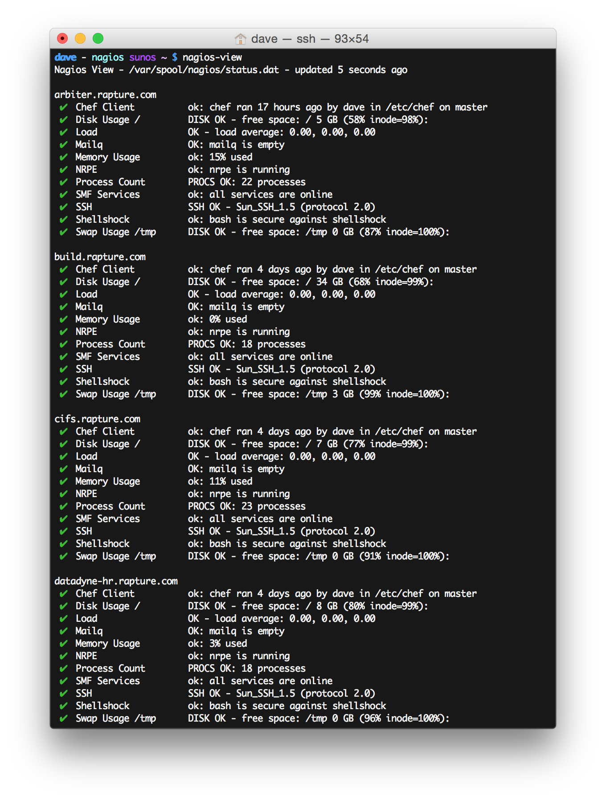
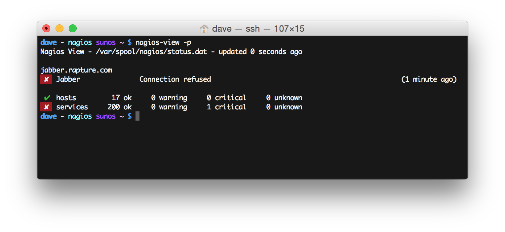
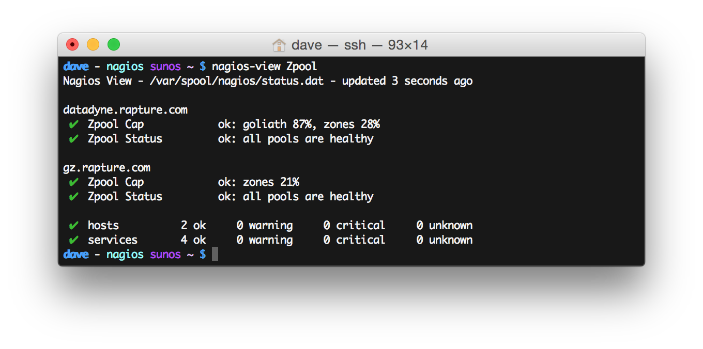
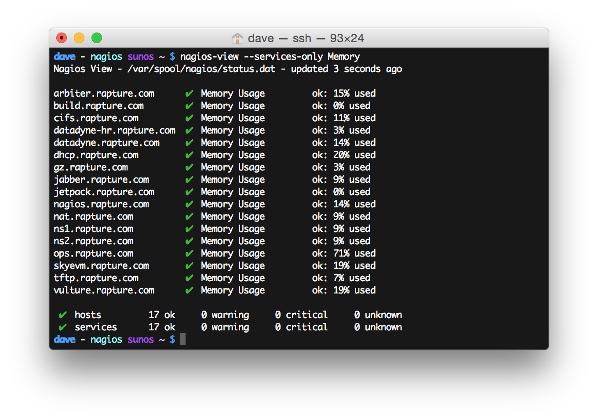
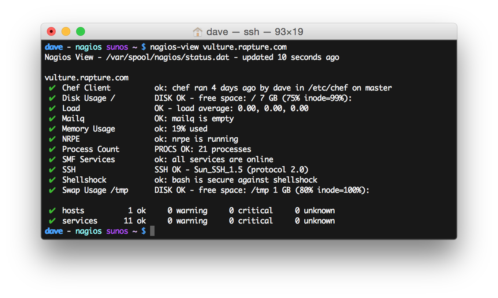
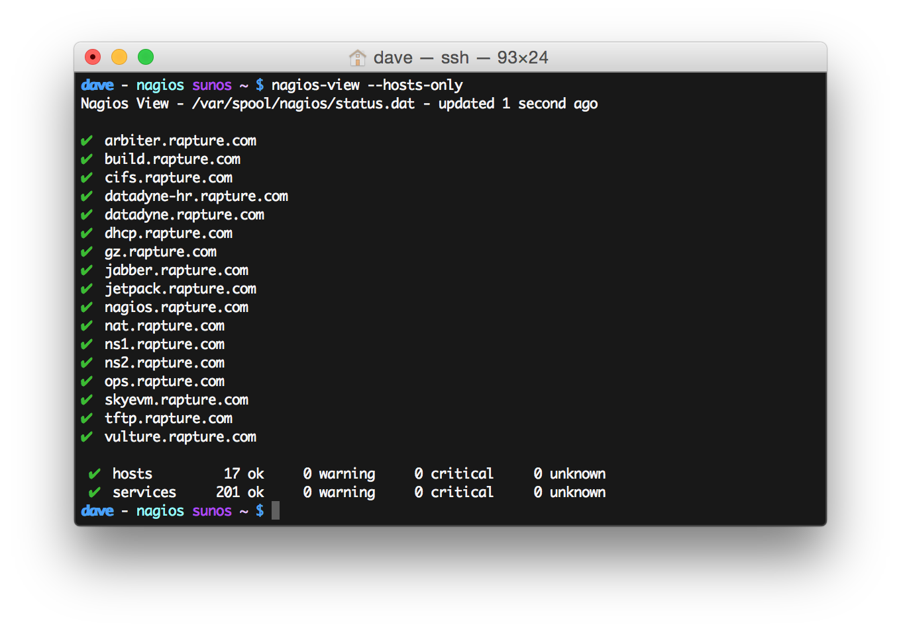
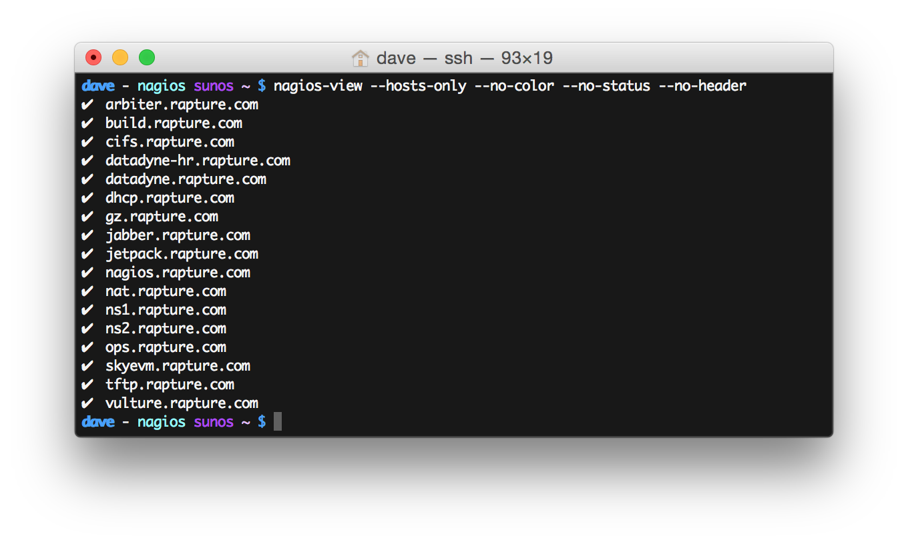

Nagios View
===========

a simple CLI doshboard for nagios using the status.dat file

NOTE: as of right now this acts as a "dashboard" - it can only read status.

Examples
--------

Run `nagios-view` with no arguments to get a summary of everything in Nagios

Add `-p` to only show hosts and services that are "problems" - anything not in the OK state

---

Anything provided as the first operand will be used to filter by service and hostname (case sensitive)

Filter for specific services

Add `--services-only` to remove breaks for different hosts and to prepend the hostname to the service line

Filter for a specific host

---

Use `--hosts-only` to only report on host status

Combine a lot of different arguments to get a custom dashboard

Usage
-----

    $ nagios-view -h
    usage: nagios-view [-hHnpsw] [-f /path/to/status.dat]

    a simple CLI doshboard for nagios using the status.dat file

    options
      -f, --file <file>         supply the path to status.dat as <file>, defaults to /var/spool/nagios/status.dat
      -h, --help                print this message and exit
      -u, --updates             check for available updates
      -v, --version             print the version number and exit

      -p, --problems            only show problem services (not OK status)
      -w, --watch               update automatically every 10 seconds indefinitely
          --hide-acknowledged   hide any services that have been acknowledged
          --status-only         only print the status lines at the bottom with totals
          --no-header           don't print header line at the top of the output
          --no-status           don't print status lines at the bottom with totals
          --hosts-only          only print hosts, not services
          --services-only       only print services, not hosts

      color output - defaults to color output if stdout is a TTY
          --color               force color output
          --no-color            disable color output

      state change times - printed by default for only problem services or hosts
          --times               print the time since last state change for all services and hosts
          --no-times            don't print the time since last state change for anything

License
-------

MIT License
